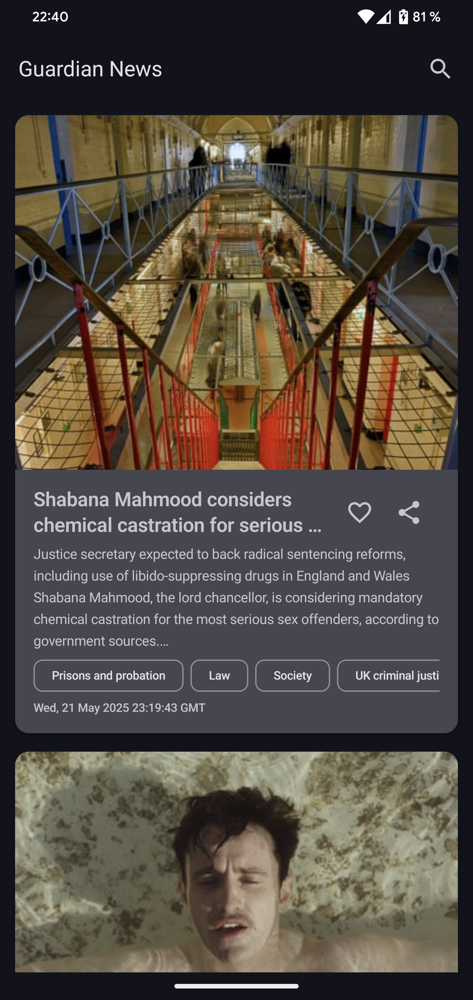
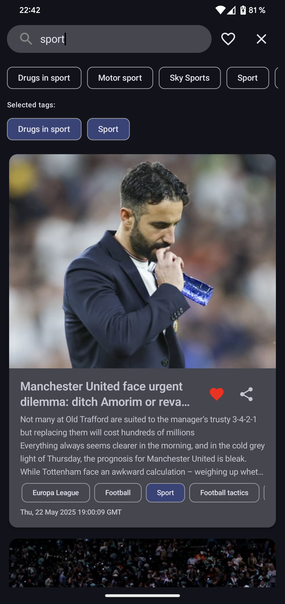

# 📰 News Aggregator — приложение для чтения новостей

## Скриншоты

| Главный экран | Поиск и фильтрация | Открытие новости |
|---------------|--------------------|------------------|
|  |  |  |

---

## Описание проекта

**News Aggregator** — это современное Android-приложение, которое позволяет читать свежие новости из RSS-ленты [The Guardian](https://www.theguardian.com).

---

## Основной функционал

- Подгрузка новостей из RSS-ленты
- Поиск по заголовкам, описаниям и тегам
- Интерактивная фильтрация по тегам
- Добавление новостей в избранное
- Pull-to-refresh для ручного обновления
- Открытие статей в Custom Tabs
- Возможность поделиться статьёй
- Кеширование новостей для оффлайн-просмотра
- Адаптивная строка поиска с подсказками и фильтрами

---

## Особенности дизайна

- Интерактивные чипы тегов с визуальным отображением фильтрации
- Адаптивная строка поиска c всплывающими подсказками
- Поддержка светлой и тёмной темы (Material 3)

---

## Используемые технологии и библиотеки

| Библиотека                    | Назначение                                          |
|-------------------------------|-----------------------------------------------------|
| Kotlin                        | Язык программирования                              |
| Jetpack Compose               | Современный декларативный UI-фреймворк             |
| Hilt                          | Внедрение зависимостей (DI)                        |
| Room                          | Локальная база данных                              |
| Retrofit2                     | Сетевые запросы (HTTP клиент)                      |
| kotlinx.serialization         | Сериализация/десериализация JSON и XML            |
| XMLUtil                       | Парсинг XML-структур (RSS)                         |
| Coil                          | Загрузка и отображение изображений                 |
| Chrome Custom Tabs            | Встраивание веб-страниц в приложение               |
| Accompanist SwipeRefresh      | Pull-to-refresh в Compose                          |
| Accompanist FlowLayout        | Реализация FlowRow для отображения тегов          |

---

## 📱 Требования к устройству

- Android 7.0 (API 24) и выше
- Доступ в интернет (для онлайн-функционала)

---
